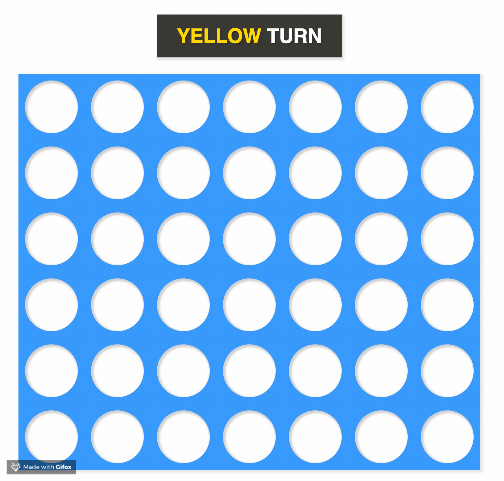

# Connect Four

Made with HTML, CSS, JS, and ❤️

## Changes

Win logic for diagonal wins should now work.
For an explanation on how it was fixed check out [this comment](https://github.com/talent-path-la/connect-four/commit/4f211c2ba7a08f121ac0f793d6d0bea3f3d1ab30#commitcomment-32257224).

## TODO
- [x] Markup
- [x] Styles
- [x] Generate board
- [x] Game rules
  - [x] selecting input toggles color
  - [x] change who's turn it is
  - [x] change who's turn is displayed
  - [x] disable invalid slots
- [x] Win logic
- [ ] Make it modular